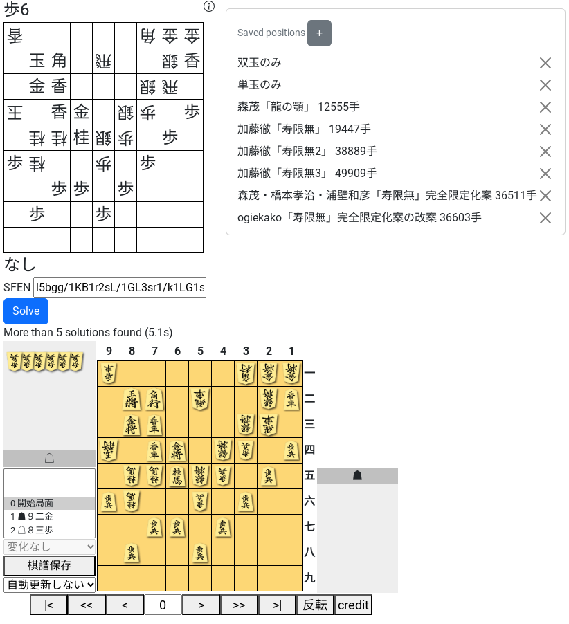

# Shogi Helpmate Solver

Rustで書かれた、[協力詰]（ばか詰）専用のソルバー



[協力詰]: https://ja.wikipedia.org/wiki/%E8%A9%B0%E5%B0%86%E6%A3%8B#%E3%83%95%E3%82%A7%E3%82%A2%E3%83%AA%E3%83%BC%E8%A9%B0%E5%B0%86%E6%A3%8B

## 使い方

https://ogiekako.github.io/fmrs にアクセスします。

- 左クリックで駒移動、右クリックで成、向きの変更
- キーボードによる操作も可能。[FM]と同じキー割当を採用しています。
- Solveボタンを押すと解図がはじまります。
- 簡易的な作問補助として、「＋」ボタンを押すことで、現在の局面に名前をつけることができます。リロードすると消滅するので注意してください。

[FM]: http://www.dokidoki.ne.jp/home2/takuji/FM.html

## FMとの違い

- FMはさまざまなルールをサポートしていますが、本ソルバーは協力詰専用です。
- 高速な解図が特徴で、例えば[寿限無]19447手を約5秒で解きます。
- 非標準駒数やフェアリー駒（石など）のサポートはありません。

[寿限無]: https://www.ne.jp/asahi/tetsu/toybox/kato/fbaka4.htm

## 注意

- サーバサイドは存在せず、計算はすべてブラウザ上で行われます。（つまりあなたの計算資源を消費します）
- 変化紛れが非常に多く、メモリ使用量が4Gを超えるような問題は解くことができません(例: [加藤徹4197手])。コマンドラインによる使用であれば、解ける可能性があります。
- 二歩があるなど、違法な初形を与えた場合の動作は未定義です。

[加藤徹4197手]: https://www.ne.jp/asahi/tetsu/toybox/kato/fbaka4.htm

## コマンドラインによる使い方

**セットアップ**

```
git clone https://github.com/ogiekako/fmrs
cd fmrs/rust
```

**実行**

`cargo run -r solve <algo> <sfen>`

- `<algo>` は `standard` か `parallel`
- `<sfen>` は [SFEN]文字列

**例:**

```
cargo run -r solve standard '8k/9/9/8N/4b4/9/9/9/9 b RGrb3g4s3n4l18p 1'
```

cargoコマンドが存在しない場合は https://rustup.rs からインストールしてください

[SFEN]: https://en.wikipedia.org/wiki/Shogi_notation#SFEN

---

# Developer info

- Benchmark https://ogiekako.github.io/fmrs/dev/bench/index.html

## Web

Install [wasm-pack](https://rustwasm.github.io/wasm-pack/installer/) and run
`npm run serve` or `npm run serve -- --port $PORT`
